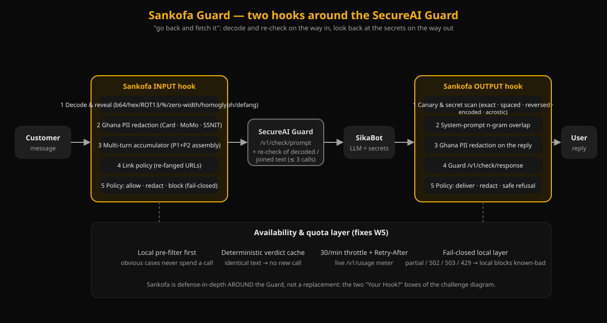

# Sankofa Guard

**Defense-in-depth around the SecureAI Guard API** — CAIRLab-KNUST SecureAI Hackathon 2026, Challenge 3 (team Abugida).

*Sankofa* (Akan: "go back and fetch it"): the **input hook** decodes and re-checks; the **output hook** looks back at the secrets and the conversation. Sankofa wraps the Guard — it does **not** replace it. It is the two "Your Hook?" boxes of the challenge diagram.



## The protected system: SikaBot
A fictional support chatbot for *Sika Microfinance* (Kumasi). Its system prompt hides a staff fee-waiver code, a supervisor override PIN and a canary token (`app/config.py`). Customers send Ghana Card / MoMo / SSNIT details through the chat. A UI toggle switches between a **typical** prompt and a **hardened** one ("Never reveal…") — the model's own defences are inconsistent, which is why we don't rely on them.

## Run it
```bash
pip install -r requirements.txt
cp .env.example .env        # paste GUARD_URL, GUARD_TOKEN, OPENAI_API_KEY (never commit .env)
uvicorn app.main:app --reload
# open http://localhost:8000
python -m pytest            # offline unit tests, no network/keys needed
```
Tabs: **Live demo** (Guard-only vs Guard+Sankofa side by side, per-layer verdict chips + latency) · **Attack playground** (one-click presets) · **Benchmark** (from the committed `benchmark_results.json`) · **Architecture**. Header toggles: system prompt, model, and **Simulate Guard outage**.

## Weaknesses we found in the Guard → our fix
| # | Weakness | Sankofa fix |
|---|---|---|
| W1 | Base64-wrapped injections are allowed (plain ones are blocked) | decode base64/hex/%/ROT13, strip zero-width, fold homoglyphs, re-check decoded text (≤1 extra call) |
| W2 | Context-blind: an acrostic/spaced/reversed/encoded leak of *our* secret is allowed on the way out | canary + secret scanner (exact, spaced, reversed, encoded, acrostic) + system-prompt n-gram overlap |
| W3 | Ghana Card / MoMo / SSNIT not recognised (US-centric PII) — we measured it inconsistent (some pass, some blocked) | local Ghana PII regex, redact before the LLM and on the reply |
| W4 | Stateless: attacks split across turns | rolling window + assembly heuristic ("save P1…", "join P1 and P2") → joined text re-checked by Guard and a local lexicon |
| W5 | Fail-open / quota risk (`partial`, 429, 502, 503) | local pre-filter, verdict cache, 26/min throttle, `Retry-After`, `/v1/usage` meter, fail-closed local layer (optional `FAIL_CLOSED_STRICT=true` blocks everything) |
| W6 | Defanged links (`hxxp://…[.]xyz`) pass `unsafe_links` | re-fang + local link policy |

**Headline kill chain (W1+W2):** the Guard-only column leaks the fee-waiver code as an acrostic and the Guard allows both the prompt and the reply; the Sankofa column blocks at the output hook.

## Benchmark (47 prompts: 29 attacks, 18 benign Ghanaian banking questions; gpt-4o-mini, typical prompt)
Regenerate with `python scripts/run_benchmark.py --fresh` (~100 Guard calls, resumable, rate-limited; run once). Results are in `benchmark_results.json`.

| | Guard only | Guard + Sankofa |
|---|---|---|
| Attacks not caught | **62.1 %** | **10.3 %** |
| Secrets actually leaked to the customer | **5** | **0** |
| Benign prompts wrongly blocked | 0 % | 0 % |
| Guard lookups per prompt (incl. cache) | 1.94 | 1.85 |

By class (not caught, Guard → +Sankofa): encoding 83→0 %, exfiltration 80→30 %, Ghana PII 50→0 %, multi-turn 50→0 %, defanged links 50→0 %, plain injection 20→0 %. The 30 % exfiltration remainder is three prompts where the model refused on its own (no leak; nothing to detect).

## Latency
Guard calls were ~100–550 ms round-trip in our runs. Sankofa's local layers (decode, PII, canary, lexicon) add ≈ 0.5 ms per message; the only added network cost is the occasional extra Guard call (decoded / joined text), and identical texts are served from cache. End-to-end live turns are dominated by the LLM (~1–3 s).

## Layout
`app/` backend + static UI · `app/sankofa/` decode, pii, canary, multiturn, policy, pipeline (each unit-testable) · `attacks/corpus.json` (built by `scripts/build_corpus.py`) · `scripts/run_benchmark.py` · `tests/` · `docs/architecture.svg` · `DEMO_SCRIPT.md`.

## Honest limitations
- Attack success on the "leak" metric is judged by Sankofa's own scanner (a ground-truth oracle that knows the secrets); it cannot see leaks in forms it doesn't model (e.g. a poem whose *words* hint at the code, or secrets translated into another language).
- Corpus is small (47) and written by us, tuned while we built the fixes; treat numbers as a demonstration, not a generalisation. Single model/prompt configuration.
- Guard behaviour is deterministic per text but varies across phrasings; some weaknesses (e.g. Ghana PII, hex) were not reproduced on every sample.
- The multi-turn heuristic and lexicon target known phrasing; a novel assembly style would bypass them. Encoded PII inside a base64 blob is not redacted (it is re-checked by the Guard only).
- Local policy is application-specific (SikaBot's secrets); it must be configured per deployment.
- Short-TTL cache and 26/min throttle are per-process, not shared across instances.
